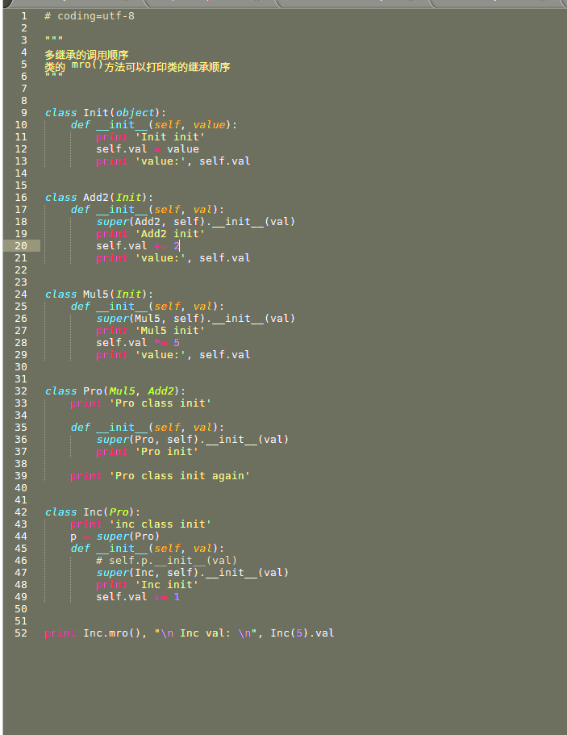

## why we need self in python

* The word **self** is not strict. We could replace it with whatever we want.
* self represents the instance of the class.

for instance:  
Class Parent:  
  def pprt(self):  
    print self  
Class Child:  
  def cprt(self):  
    print self  

c = Child() #c is the instance of Child() class
c.cprt()
c.pprt()
p = Parent() # p is the instance of Parent() class
p.pprt()

we could treat c.cprt() as Child.cprt(c)

[see more](http://python.jobbole.com/81921/)

[or here](https://stackoverflow.com/questions/2709821/what-is-the-purpose-of-self)

## The order of inheritance

